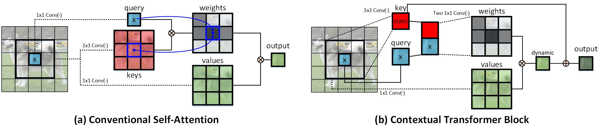
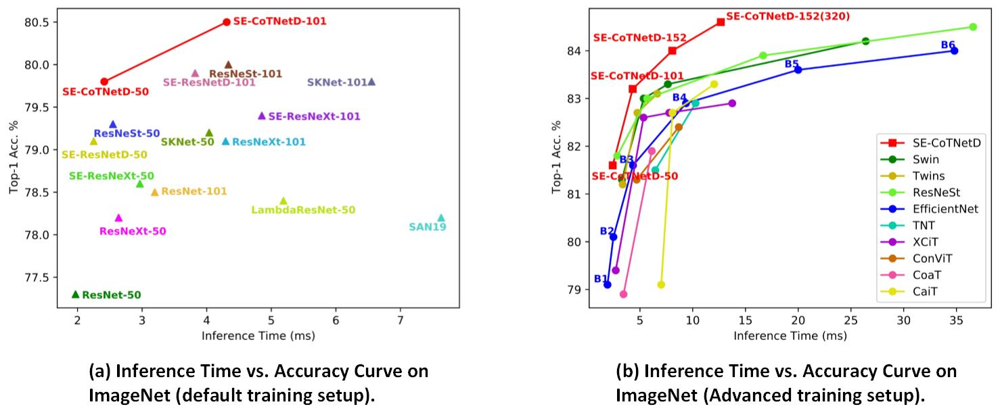

# Introduction
This repository is the official implementation of [**Contextual Transformer Networks for Visual Recognition**](https://arxiv.org/pdf/2107.12292.pdf). 

CoT is a unified self-attention building block, and acts as an alternative to standard convolutions in ConvNet. As a result, it is feasible to replace convolutions with their CoT counterparts for strengthening vision backbones with contextualized self-attention.

<p align="center">
  
</p>

# 2021/3/25-2021/6/5: CVPR 2021 Open World Image Classification Challenge
**Rank 1** in [Open World Image Classification Challenge](https://eval.ai/web/challenges/challenge-page/1041/leaderboard/2695) @ CVPR 2021. (Team name: VARMS)


# Usage
The code is mainly based on [timm](https://github.com/rwightman/pytorch-image-models).

### Requirement:
* PyTorch 1.8.0+
* Python3.7
* CUDA 10.1+
* [CuPy](https://cupy.dev/). 

### Clone the repository:
```
git clone https://github.com/JDAI-CV/CoTNet.git
```

### Train 
First, download the [ImageNet](https://github.com/facebookarchive/fb.resnet.torch/blob/master/INSTALL.md) dataset. To train CoTNet-50 on ImageNet on a single node with 8 gpus for 350 epochs run:
```
python -m torch.distributed.launch --nproc_per_node=8 train.py --folder ./experiments/cot_experiments/CoTNet-50-350epoch
```
The training scripts for CoTNet (e.g., CoTNet-50) can be found in the [cot_experiments](cot_experiments) folder.

# Inference Time vs. Accuracy
CoTNet models consistently obtain better top-1 accuracy with less inference time than other vision backbones across both default and advanced training setups. In a word, CoTNet models seek better inference time-accuracy trade-offs than existing vision backbones.

<p align="center">
  
</p>

## Results on ImageNet
| name | resolution | #params | FLOPs | Top-1 Acc. | Top-5 Acc. | model |
| :---: | :---: | :---: | :---: | :---: | :---: | :---: | 
| CoTNet-50 | 224 | 22.2M | 3.3 | 81.3 | 95.6 | [GoogleDrive](https://drive.google.com/file/d/1SR5ezIu7LN943zHaUh4mC0ehxBVMqtfv/view?usp=sharing) / [Baidu](https://pan.baidu.com/s/1czr00SglgD8dNVK8jT1yLg) |
| CoTNeXt-50 | 224 | 30.1M | 4.3 | 82.1 | 95.9 | [GoogleDrive](https://drive.google.com/file/d/1j6b5D3xcZ5L_bHiQV0WfqyOieqZLVOCv/view?usp=sharing) / [Baidu](https://pan.baidu.com/s/1CeV9IH_P5N9yuO-wOpdGNw) |
| SE-CoTNetD-50 | 224 | 23.1M | 4.1 | 81.6 | 95.8 | [GoogleDrive](https://drive.google.com/file/d/1D2b5fr3lxpBpiFcCYBKngmmSgfVHt_56/view?usp=sharing) / [Baidu](https://pan.baidu.com/s/1s5Xg7AqzWuwFJUzOJDoo4Q) |
| CoTNet-101 | 224 | 38.3M | 6.1 | 82.8 | 96.2 | [GoogleDrive](https://drive.google.com/file/d/11jExbPEg4Eq5PApisZyE5k-1CbRYnsQb/view?usp=sharing) / [Baidu](https://pan.baidu.com/s/1Olpta0AV7N4OoiC8PB4BnA) |
| CoTNeXt-101 | 224 | 53.4M | 8.2 | 83.2 | 96.4 | [GoogleDrive](https://drive.google.com/file/d/1des5wgkBDUscQAs8IYOmKCKKUA46QLfJ/view?usp=sharing) / [Baidu](https://pan.baidu.com/s/1FM0QRZJee7uY7iKaEiUA-w) |
| SE-CoTNetD-101 | 224 | 40.9M | 8.5 | 83.2 | 96.5 | [GoogleDrive](https://drive.google.com/file/d/1PWIltQYpYZiDrpfZORRQzGzQeXVd2b2f/view?usp=sharing) / [Baidu](https://pan.baidu.com/s/1WGFzuwio5lWJKiOOJTnjdg) |
| SE-CoTNetD-152 | 224 | 55.8M | 17.0 | 84.0 | 97.0 | [GoogleDrive](https://drive.google.com/file/d/1MkMx0a8an3ikt6LZwClIOyabBnMfR91v/view?usp=sharing) / [Baidu](https://pan.baidu.com/s/14mNVsSf-6WI3mxLN2WinWw) |
| SE-CoTNetD-152 | 320 | 55.8M | 26.5 | 84.6 | 97.1 | [GoogleDrive](https://drive.google.com/file/d/1E43T2jS37gR07p_FVWnjJNkMWeYMXgX9/view?usp=sharing) / [Baidu](https://pan.baidu.com/s/1kO5of8IPgL4HOudLeykS6w) |

Access code for Baidu is **cotn**

## Citing Contextual Transformer Networks
```
@article{cotnet,
  title={Contextual Transformer Networks for Visual Recognition},
  author={Li, Yehao and Yao, Ting and Pan, Yingwei and Mei, Tao},
  journal={arXiv preprint arXiv:2107.12292},
  year={2021}
}
```

## Acknowledgements
Thanks the contribution of [timm](https://github.com/rwightman/pytorch-image-models) and awesome PyTorch team.
